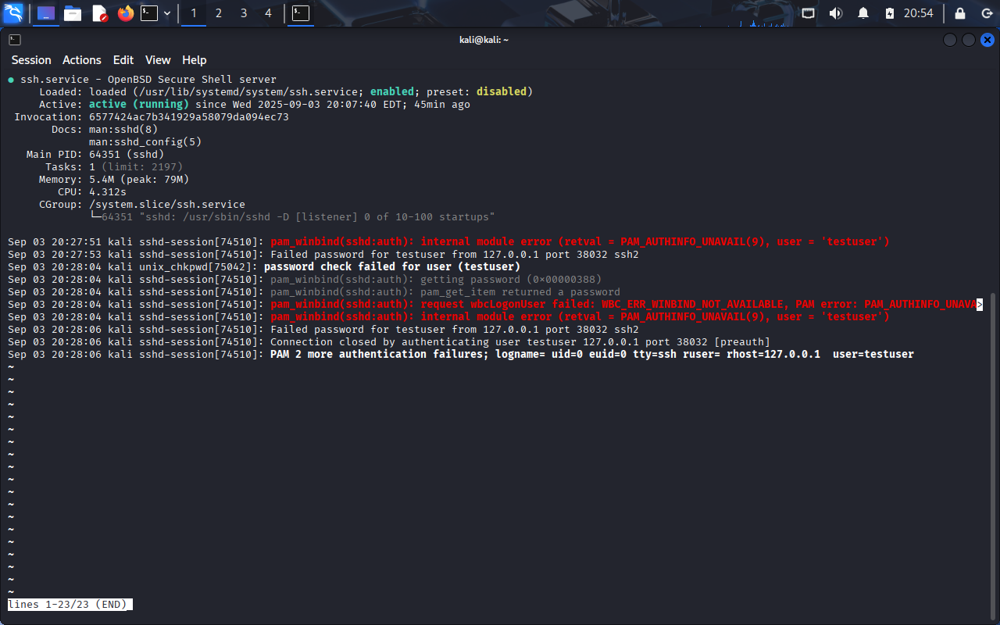
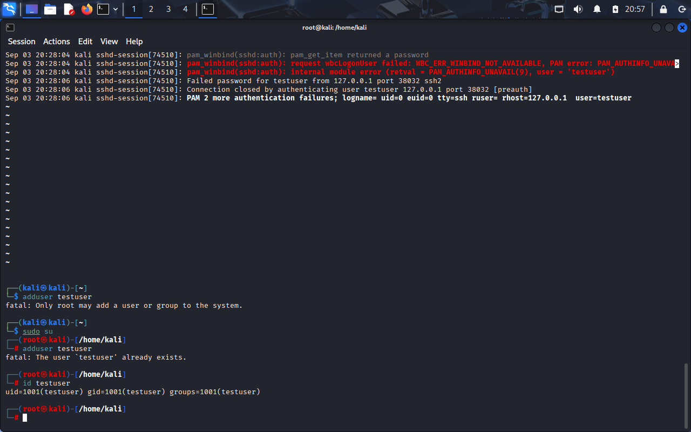
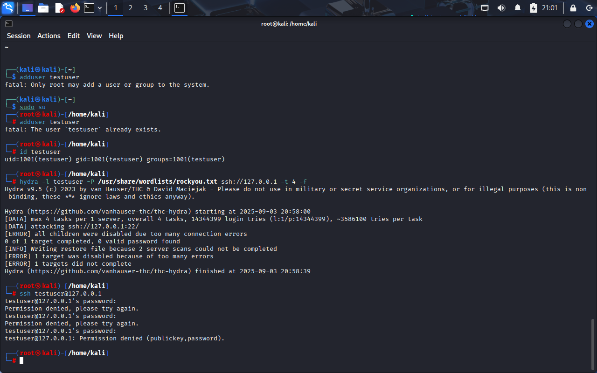
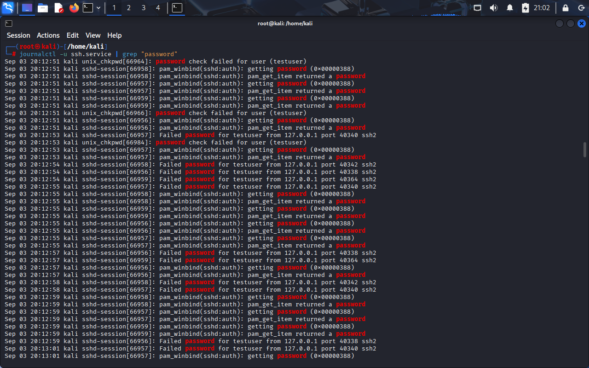
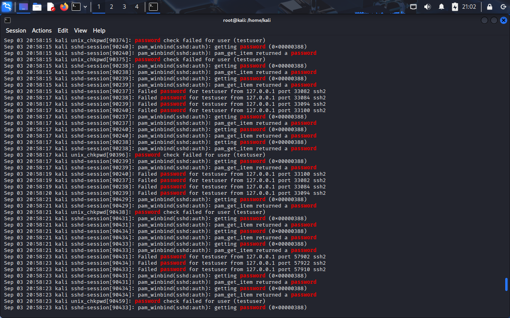
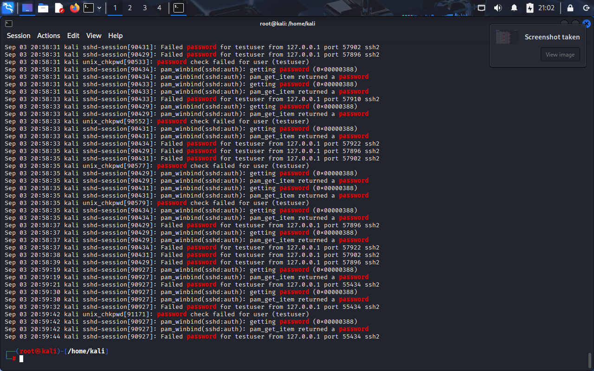
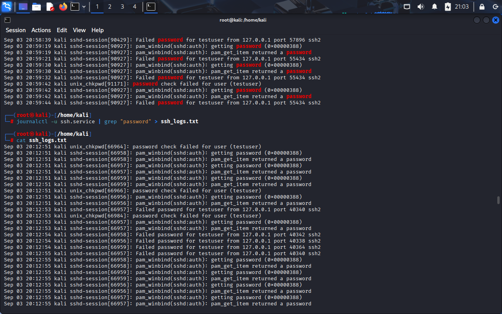
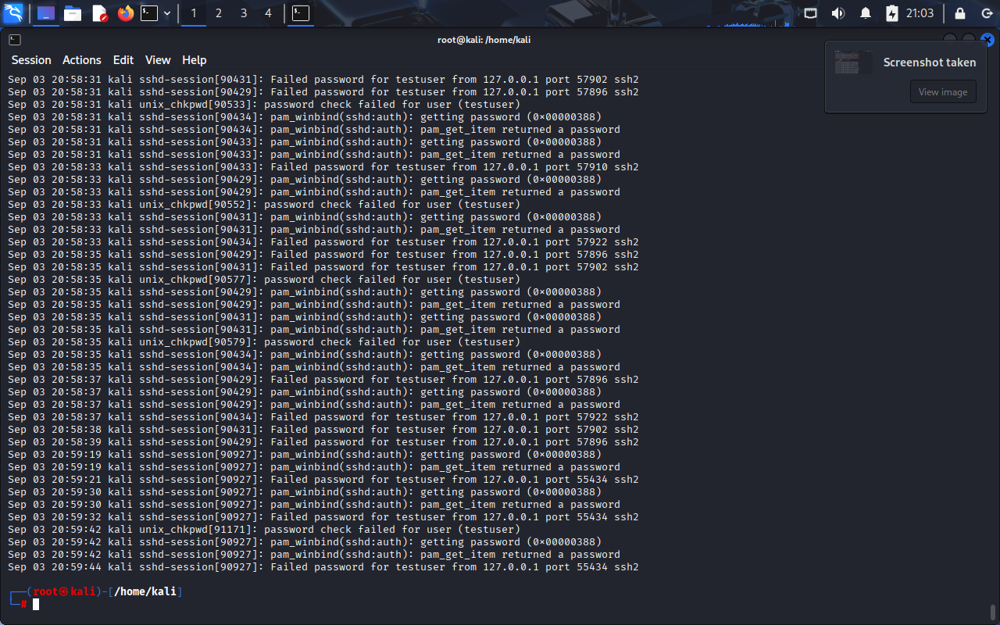

# SOC-BruteForce-Detection
Detection &amp; Incident Response of Brute Force Attacks using SIEM (CSA Project)

# 🚨 SOC L1 Project – Detecting Brute Force Attack on SSH

## 📌 Objective
Simulate and detect a brute force attack on an SSH service using Linux logs.  
This project demonstrates how a SOC Level-1 Analyst identifies suspicious login attempts from system logs.

---

## ⚙️ Environment Setup
- **OS:** Kali Linux
- **Service:** OpenSSH
- **User:** `testuser`
- **Tools Used:** Hydra, journalctl, grep

---

##  Steps Performed

### 1️. Enable SSH Service
```bash
sudo systemctl enable ssh && sudo systemctl start ssh && sudo systemctl status ssh
```


### 2. Create New User
```bash
sudo adduser testuser
```


### 3. Simulate Brute Force Attack using Hydra
```bash
hydra -l testuser -P /usr/share/wordlists/rockyou.txt ssh://127.0.0.1 -t 4 -f
```


### 4. Verify Attack in Logs
```bash
journalctl -u ssh.service -n 20
```




### 5. Successful SSH Login
```bash
ssh testuser@127.0.0.1
```



### 6. Save SSH Logs to File
```bash
journalctl -u ssh.service > ssh_logs.txt
```
Extracted log file → [ssh_logs.txt](ssh_logs.txt)


### Deliverables
 - ssh_logs.txt → Extracted log file with brute force attempts
 - screenshots/ → Folder containing all step screenshots
 - README.md → Project documentation (this file)


### Conclusion
   - Enable and monitor SSH service
   - Detect brute force attacks using system logs
   - Extract and save relevant logs for further analysis
   - Understand attack patterns and respond to incidents


